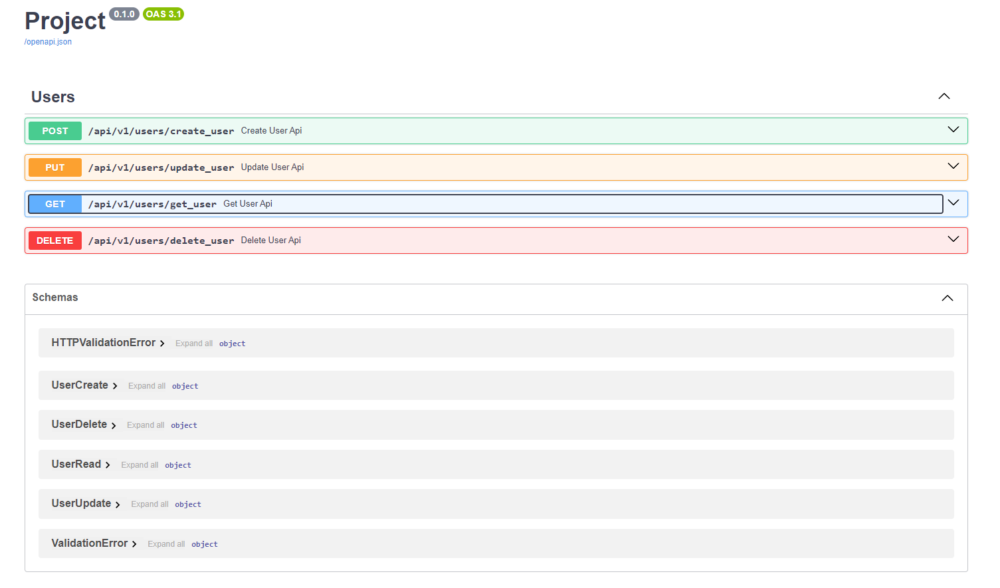

# Запуск проекта

#### Для работы приложения необходимо:
- Установить все зависимости из pyproject.toml (poetry install --no-root).
- Создать файл `.env` с информацией для подключения к базе данных в формате:
  - DB_HOST=localhost
  - DB_PORT=5432
  - DB_NAME=databasename
  - DB_USER=username
  - DB_PASS=password

#### Перед первым запуском необходимо:
- Проинициализировать все отношения в базе данных при помощи команды `alembic upgrade head`. А также для
корректной работы импортов сделать `src` корневым каталогом.

#### Запуск производится из файла `main.py`.

# Структура проекта

## src/
- **.env**: Файл конфигурации с переменными среды, такими как настройки базы данных.
- **alembic.ini**: Конфигурационный файл для Alembic, используемый для миграций базы данных.
- **main.py**: Главный файл приложения, точка входа в программу.

## alembic/
- **env.py**: Конфигурационный файл среды для Alembic.
- **README**: Информация и инструкции по использованию Alembic.
- **script.py.mako**: Шаблонный файл для создания новых скриптов миграций.
- **versions/**: Содержит версии миграций.

## api/
- **api_v1/**
  - **users.py**: Обработчики маршрутов для управления пользователями.

## core/
- **config.py**: Файл конфигурации приложения. Содержит все необходимые настройки, в том числе типы репозитория для хранения пользователей.
- **exception/**
  - **exception_handlers.py**: Обработчики исключений.
  - **exceptions.py**: Определения пользовательских исключений.
- **models/**
  - **base.py**: Базовые классы для моделей данных.
  - **db_helper.py**: Вспомогательные функции для работы с базой данных.
  - **user.py**: Определения модели пользователя.
- **repositories/**
  - **repository_factory.py**: Фабрика репозиториев для создания экземпляров репозиториев.
  - **repository_interface.py**: Интерфейсы для репозиториев.
- **schemas/**
  - **user.py**: Схемы данных для пользователя.
- **services/**
  - **\_\_init\_\_.py**: Инициализирующий файл для сервисов.
  - **user_service.py**: Логика работы с пользователями.

## crud/
- **users_in_database.py**: Операции CRUD для работы с пользователями в базе данных.
- **users_in_memory.py**: Операции CRUD для работы с пользователями в памяти.

При запуске можно воспользоваться документацией Swagger, доступной по адресу /docs.

